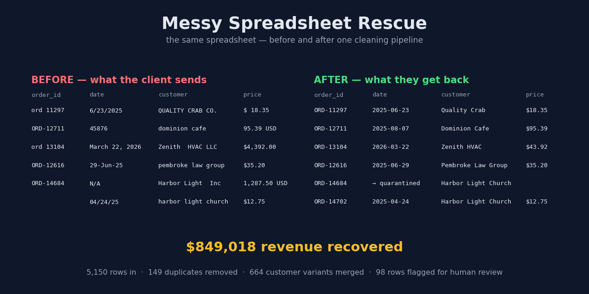

# 🧹 Messy Spreadsheet Rescue

**Your spreadsheet is a mess. This is what getting it fixed looks like.**



This is a complete, working demo of a data-rescue job: **5,150 rows** of
realistically broken sales data — five different date formats, prices stored as
text, the same customer spelled six ways, duplicate orders, decimal-shift typos
— go in. Out comes a clean dataset, an **itemized rescue report**, and a live
interactive dashboard.

## The headline

| | |
|---|---|
| Revenue visible to a naive sum | $587,291.65 |
| Revenue after rescue | **$1,436,309.60** |
| **Revenue recovered by cleaning** | **$849,017.95** |

That's 59% of this business's revenue **invisible** before cleaning — because
`$1,234.56` and `1,234.56 USD` aren't numbers to a spreadsheet, they're text.

Full itemized results: **[RESCUE_REPORT.md](RESCUE_REPORT.md)** — every count
is produced by the pipeline itself, nothing estimated.

## What the pipeline fixes

- **Dates** in 5+ formats, including raw Excel serial numbers (`46045`)
- **Prices as text** — `$1,234.56`, `1,234.56 USD`, `$ 18.35`
- **Duplicate customers** — `QUALITY CRAB CO.`, `quality crab co`, `Quality Crab Co ` → one customer
- **Decimal-shift typos** — a $42 item entered as $4,200, caught against the product's price history
- **Duplicate rows** — exact re-pastes *and* re-entered orders under a different date format
- **Category typos, region variants, fake-missing values** (`N/A`, `NULL`, `-`), stray whitespace

And the part that matters most: **ambiguous rows are quarantined with a
reason, never silently guessed.** A human makes the judgment calls — the
script just makes them easy.

## Run it yourself

```bash
pip install -r requirements.txt
python -m rescue.make_mess     # generate the diseased dataset (seeded, reproducible)
python -m rescue.report        # run the rescue -> clean_sales.csv + RESCUE_REPORT.md
streamlit run rescue/dashboard.py   # the interactive dashboard
```

Everything runs offline from the bundled data. No accounts, no API keys.

## What's in the box

```
rescue/
  make_mess.py    # generates the realistic messy dataset (every disease documented)
  clean.py        # the rescue pipeline - every fix counted, ambiguity quarantined
  report.py       # renders the client-facing rescue report
  dashboard.py    # Streamlit dashboard: KPIs, trends, before/after, report
  make_card.py    # renders the social card
data/
  messy_sales.csv   # the horror (5,150 rows)
  clean_sales.csv   # the rescue (4,903 rows)
  quarantine.csv    # flagged rows + reasons (98 rows)
```

## Why this exists

I build small, reliable data tools — cleanups, automations, dashboards — for
businesses that don't need a full-time developer. This repo is a worked
example of my favorite kind of job: *"our data is a disaster, can you make it
make sense?"* Yes. This is what that looks like.

**Noah Spiroff** · [github.com/Nspiroff](https://github.com/Nspiroff)

> ⚠️ The dataset is synthetic (generated by `make_mess.py`) so the demo is
> fully reproducible and contains no real business data.

## License

MIT
